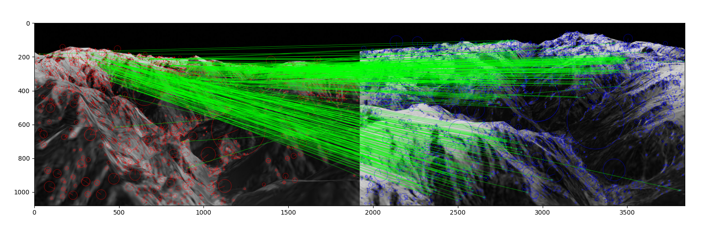
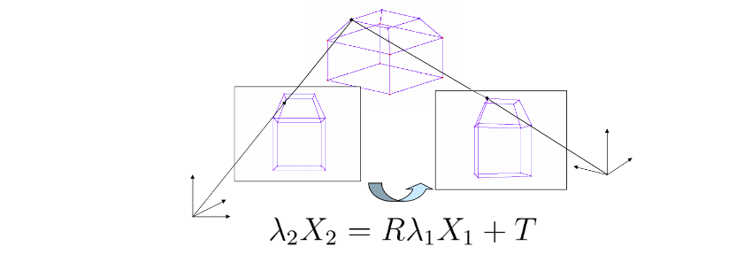

# Large scale Multi-Agent Mapping toolkit.
This project is in Active Development and the repository is subject to change.

This project can solve all these challenges to a great extent and even offers over the top functionality. Using the presented approach we can complete the following objectives:
1. The image sequence coming from the camera is sufficient for extracting most valuable informations required by a fully autonomous robotic architecture. These quantities include:
  * Depth in 2D image, (x,y)-->(x,y,z)
  * Instantaneous Position and Orientation of the camera as pose(x,y,z,roll,pitch,yaw)
  * Continuous 3D map of the environment from stitching estimated 3D image wrt pose
  * Process this 3D map to find regions of interest for applications in search and rescue robotic systems
2. Another objective we plan to achieve by the end of this project is to make the methods available as an open source package fully compatible with the filesystem of Robot Operating System(ROS) over a Linux kernel. This allows a plug and play functionality for Robotic and CV developers.

2D cameras cannot perceive depth in any way, but we can estimate the depth purely based on how each pixel changes from frame to frame. This of course presents its set of challenges:

1. The depth estimation proceeds via computational optimization problem, hence the depth estimate is completely random at t=0 and as time progresses, this estimate converges to an optimal estimate, accurate estimate at t=infinity.

2. The camera pose estimation based on feature changes in frame sequence is subject to errors due to camera distortions that accumulate over time.

3. Processing every pixel of an image exponentially increases the computational cost and makes real time implementation almost impossible.

4. While mapping depth images, camera might move to new areas before previous frames depth is mapped, which causes localization loss.

Processing an entire image data for 3D reconstruction is computationally extremely heavy.
Hence we use algorithm described by [5],ORB/SIFT features to detect certain keypoints in image that describe most significant features in the image

Once we have detected significant keypoints in an image, we can track these keypoints from one frame to another.
We use a feature matching step to find out how each keypoint moved in the current frame wrt previous frame.

Here, Red and Blue are features in 2 frames respectively and Green represents the one to one match.

## 3D Transformation and Pose Estimation
The Features we have detected till now are in the 2D plane
Based on the feature tracking, we estimate how each feature has moved in one frame with respect to the previous frame.[4],[6]
Based on this estimated movement and the fact each feature only varies from nth to (n+dn)th frame only if the surface feature is a part of a significant 3D surface.
This mathematical model relates the features from one frame to another

Dense PointCloud w/ Stereo reconstruction

